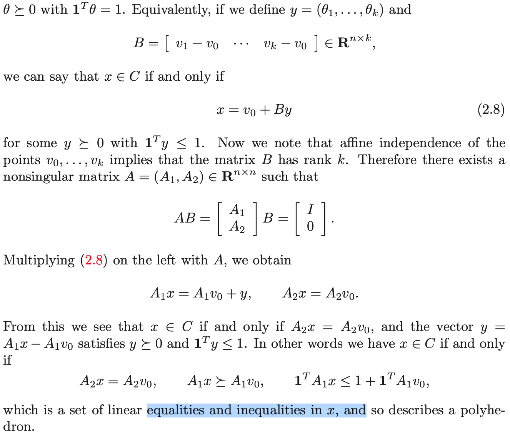
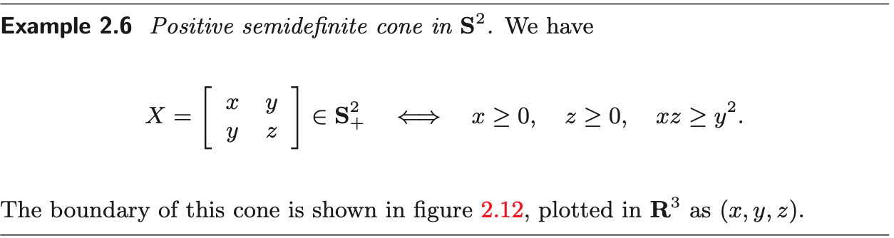
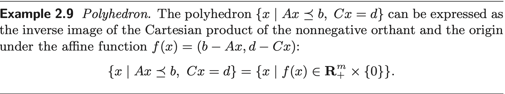
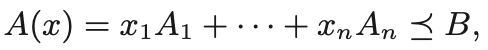
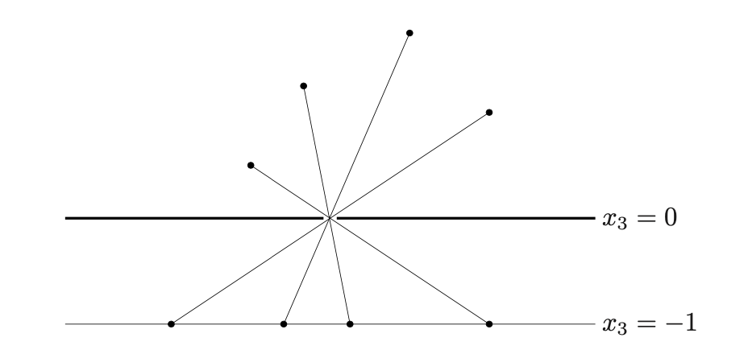
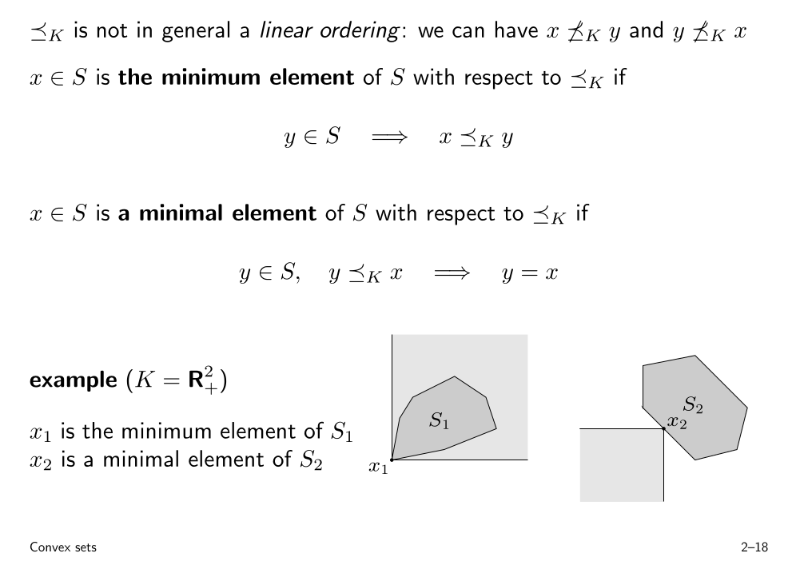
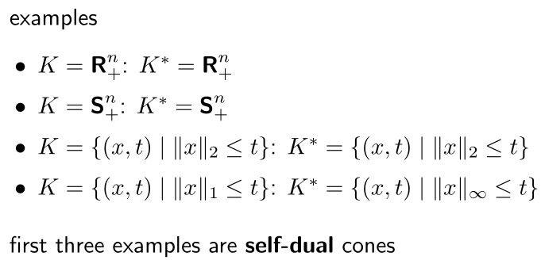
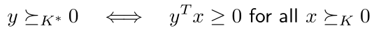
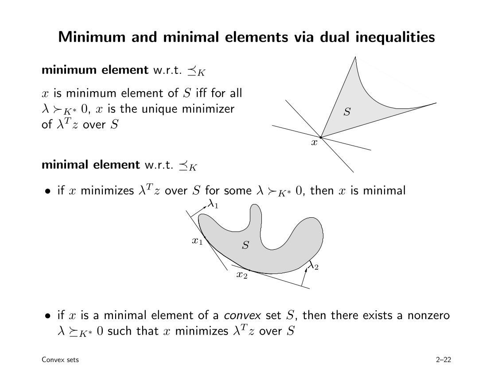
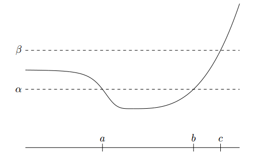

# Convex Optimization

## preface

传统的最小二乘问题和线性规划问题是凸优化问题的子问题。

凸优化可以应用在在自动控制系统、估计、信号处理、网络通信和架构、电路设计、数据建模和分析、统计学和金融领域。将一个实际问题建模成凸优化问题，便可以稳定高效地求解；并且有时候可以寻求该问题的对偶问题，这可能带来更高效或分布式的方法。

## 概念

### 优化问题

$$
\begin{equation}\label{opt_problem}\begin{aligned}
\min\quad &f_0(x)\\
\mbox{s.t.}\quad &f_i(x)\le b_i,\quad i=1,\dots,m.
\end{aligned}\end{equation}
$$

|   $x$    |        $f_0$         |  $f_i$   |
| :------: | :------------------: | :------: |
| 优化变量 | 目标函数（损失函数） | 约束函数 |

### 凸函数的定义

$$
f_i(\alpha x+\beta y)\le\alpha f_i(x)+\beta f_i(y)
$$

### 特殊形式的优化问题

大型系统：非常多的变量和约束（维数高）；

稀疏问题：每个约束函数只依赖于少数变量。

### 优化问题

#### 1、传统最小二乘

对于 $A\in \mathbb{R}^{k\times n}$，最小二乘问题的目的是找到使以下目标函数最小的优化变量，
$$
f_0(x)=\Vert Ax-b\Vert^2_2=\sum_{i=1}^k(a_i^Tx-b_i),
$$
以上最小二乘问题可以退化为求解线性方程
$$
(A^TA)x=A^Tb,
$$
这个方程的计算时间复杂度为 $n^2k$. 若矩阵 $A$ 是稀疏的，那么可以有更快的计算方法（根据 $A$ 的不同稀疏样式设计）。

#### 2、加权最小二乘

将各样本对应的损失函数乘上权重，表示各个对优化结果的影响程度。
$$
\sum_{i=1}^k w_i(a_i^Tx-b_i)^2.
$$

#### 3、Regularization 最小二乘

通过加上一个惩罚项 $\lambda$，使优化变量 $x$ 不至于过大。 
$$
\sum_{i=1}^k (a_i^Tx-b_i)^2+\lambda\sum_{i=1}^n x_i^2.
$$

#### 4、线性规划

线性规划问题可以使用单纯形法和内点法求解，内点法的计算时间复杂度也是 $n^2m$，但是相比于最小二乘法，该时间复杂度需要乘的常数更难以分析。值得注意的是，内点法虽然很稳定，但稳定性不如最小二乘法。
$$
\begin{equation}\begin{aligned}\min\quad &c^Tx\\
\mbox{s.t.}\quad &a_i^Tx\le b_i,\quad i=1,\dots,m.
\end{aligned}\end{equation}
$$

**经典例子:** 切比雪夫近似问题:
$$
\min\quad \max_{i=1,\dots,k}\vert a_i^Tx-b_i\vert,
$$
与最小二乘中所述类似，这是一个目标函数 $f_0$ 为估计值与真实值之差的一范数问题，但是这个目标函数是不可导的。它可以转化为线性规划问题
$$
\begin{equation}\begin{aligned}\min\quad &t\\
\mbox{s.t.}\quad &a_i^Tx-t\le b_i,\quad i=1,\dots,k\\
&-a_i^Tx-t\le -b_i,\quad i=1,\dots,k,
\end{aligned}\end{equation}
$$

#### 5、凸优化

在 $\eqref{opt_problem}$ 问题中 $f_0,\,f_1,\dots,\,f_m$ 都是凸函数时，就是一个凸优化问题。与线性规划类似，同样通常使用内点法求解，它每一步迭代的时间复杂度为
$$
\max\{n^3,n^2m,F\},
$$
$F$ 是计算目标函数和约束函数 $f_0,\,f_1,\dots,\,f_m$ 的一阶和二阶导数的时间。

将一个实际问题转化为凸优化问题是很困难的，其中有很多的技巧，这是这本书主要学习的内容。

#### 6、非线性优化

这类问题的目标函数和约束函数是非线性的，但不知道是否是凸函数。这类问题还没有一个最好的方法来解决，提出了3种方法，各有利弊。

* **局部优化**：在可行点内找好的点，而不是全局最好的点。优点：快速。缺点：不一定是全局最优解，非常依赖于初值，不知道离全局最优有多远，针对不同问题需要调整不同的参数（如步长）。局部优化分三步：1.选择一个算法，2.调参，3.找到一个足够好的初始点。与凸优化相反，局部优化的困难在于如何求解，而相比之下能够更直观地将现实问题构造成局部优化问题。
* **全局优化**：超难计算。

#### 7、非凸优化

* 结合凸优化和局部优化方法来求解：先找到非凸问题的一个近似凸问题，这个凸问题得到的解作为针对非凸局部优化中的初始点；

* 启发式方法结合凸优化来求解；
* Bounds：使用一个凸上(下)界来包含非凸问题最优值的上(下)界。

## 定义

### 直线

由 $x_1$ 和 $x_2$ 两个点的线性组合构成直线：
$$
\theta x_1+(1-\theta) x_2
$$

### 仿射集

集合内任意两点的所构成的直线依然在该集合内，则该集合为仿射集合。

可以证明线性方程组的解空间都是仿射集合，而所有仿射集合都可以写成线性方程组的解的形式。

仿射包（**aff** $C$）：包含集合 $C$ 的最小仿射集合；

仿射维度：集合的仿射包的维度；

相对内部（**relint** $C$）：

### 凸集

集合内任意一点可以直接“看到”另外一点。（仿射集中的直线->线段）

凸包（**conv** $C$）：包含集合C的最小凸集；

### 凸锥

集合上任意一点与原点的射线在集合内。

锥包：顾名思义，包含集合 $C$ 的最小凸锥。

### 超平面

$$
\begin{equation}\begin{aligned}
C=\,&\{x\,|\,a^T(x-x_0)=0\}\\
=\,&\{x\,|\,a^Tx=b\}
\end{aligned}\end{equation}
$$

可见超平面是一个仿射集，它将高位空间分为两个半空间，半空间不是仿射集，但是凸集。

### 范数锥

$$
C=\{(x,t)\in \mathbb{R}^{n+1}\,\vert\,\Vert x\Vert_2\le t\}
$$

在2维Euclidean范数下就是圆锥。

### 多角体（polyhedra）

$$
P=\{x\,|\,Ax\le b,\,Cx=d\}
$$

它是由多个超平面分割而成的空间。一定是凸的。

**单纯形** 是多角体的重要成员。若有 $k+1$ 个仿射不相关的点集{$v_0,\dots,v_k$}，那么单纯形可以表示为它们的凸包：
$$
\begin{equation}\begin{aligned}
C=&\,\mbox{conv}\{v_0,\dots,v_k\}\\
=&\,\{\theta_0v_0+\cdots+\theta_kv_k\,|\,\theta\ge0,\ 1^T\theta=1\}.
\end{aligned}\end{equation}
$$
它的仿射维度为 $k$. 

将单纯形写作多角体的形式：

### 半正定锥

一个对称矩阵 $S\in \mathbb{R}^n$ 有 $n(n+1)/2$ 个未知的 entries {$x_1,x_2,...$}（也就是这么多维度），在这些 entries 形成的空间中，半正定矩阵的 entries 所在的空间是一个凸锥，称为半正定锥。

## 保持凸性的运算操作

1. 多个凸集之间的交运算还是凸集；

2. 凸集经过仿射运算后还是凸集。仿射运算包括

   * $f(x)=Ax+b$（包含平移、放缩）

   * $f^{-1}(x)$

   * 对该凸集某些坐标上的投影（去除某些维度）

   * 两个凸集相加和部分相加（通过两个凸集的笛卡尔积向 $f(x)=x_1+x_2$ 作投影可证）

     （注：两个凸集 $S_1,S_2$ 的笛卡尔积 $S_d$ 还是凸的）（注意，相加不是集合的并运算）

例1：多角体可以描述为集合 $x$ 经仿射变换 $f(x) = (b − Ax, d − C x)$ 后与集合 $\{0\}$ 的笛卡尔积，

例2：线性矩阵不等式（LMI）

其中 $A$、$B$ 均为对称矩阵，该不等式的解空间是一个凸集：半正定锥在仿射方程 $f(x)=B-A(x)$ 上的逆映射。

例3：**双曲线锥**
$$
\{x\,\vert\,x^TPx\le (c^Tx)^2,\,c^Tx\ge0\}
$$
是二次锥 $\{(z,t)\,|\,z^Tz\le t^2,\,t\ge0\}$ 在仿射方程 $f(x)=(P^{1/2}x,c^Tx)$ 上的逆映射；

例4：**椭球**
$$
\{x\,|\,(x-x_c)^TP^{-1}(x-x_c)\le 1\}
$$
是球 $\{u\,|\,\Vert u\Vert_2\le1\}$ 在仿射方程 $f(x)=P^{1/2}u+x_c$ 上的映射。

3. 两个（降维）方程

**透视方程**：如下图所示，在三维空间中，$x_3=0$ 为不透光的透视平面，$x_3=-1$ 为幕布。透视平面上方的点所发出的光经过透视平面上的孔洞，投影到幕布上的坐标去掉幕布所在的维度后（因为所有点投影过来后在该维度上取相同的值）作为方程的输出。

$P:R^{n+1}\rightarrow R^n$， 其中 **dom** $P=R^n\times R_{++}$,

$P((\vec{x},x_3),\bar{x}_3=t)=\vec{x}/t$, 其中 $x_3\in R_{++},\,t\in R_{--}$.

定理：一个凸集经过透视方程转换后还是凸集。

意义：$n$ 维中的线段都可以由一个 $n+1$ 维点和一个透视方程表示。

用 $\theta x+(1-\theta)y$  代表一条在 $R^{n+1}$ 中经过 $x,\,y$ 两点的线段，其中 $\theta\in [0,1],\,x=(\tilde{x},x_{n+1}),\,y=(\tilde{y},y_{n+1})\in R^{n+1}$ 。这条线段经过透视函数 $P$ 投影所得到的线段，是 $P(x)$ 与 $P(y)$ 的凸组合。简单来说就是 $P([x,y])=[P(x),P(y)]$.

**线性分式（投影）方程：**是仿射方程与透视方程的结合。首先利用仿射变换 $g$ 将一个 $n$ 维的向量映射到 $m+1$ 维空间，然后通过透视变换 $P$ 将其映射到 $m$ 维。为了方便表示，将仿射方程写为
$$
g(x)=\left[ \begin{array}{c}
A\\c^T
\end{array}\right]x+\left[ \begin{array}{c}
b\\d
\end{array}\right],
$$
则线性分式方程可以表示为
$$
f(x)=(Ax+b)/(c^Tx+d),\quad \mbox{dom}\ f=\left\{x|c^T+d>0\right\},
$$
这个方程还可以用矩阵方程表示。

例子：条件概率空间是概率空间的线性分式投影。所以若联合概率空间是凸的，那么其条件概率空间也是凸的。

### 广义不等式

真锥（proper cone）$K$ 的定义：凸、闭、无空内点、不包含线（$x\in K,-x\in K\Rightarrow x=0$）。利用真锥可以定义不等式
$$
x\le_K y \Leftrightarrow y-x\in K,
$$

* $K=R_+$ 是一个常见的真锥，此时 $\le_K$ 退化为 $\le$。

* $K=S_+$ 是真锥，此时 $X\le_K Y$ 表示 $Y-X\in S_+$.

*  $K=\{c\in R^n|c_1+c_2t+\dots+c_nt^{n-1}\ge0\ \mbox{for}\ t\in[0,1]\},$ 是多项式非负真锥。

广义不等式拥有数值不等式的大多数性质，但是有些不一样：在广义不等式中，并不是集合 $K$ 内任意的两个元素都是可以直接做比较的，这使得最大最小值问题变得复杂。

---

**广义线性不等式定理**：广义线性严格不等式
$$
Ax<_Kb
$$
可以转化为：不存在 $\lambda$ 使
$$
\lambda\neq0,\quad\lambda\ge_{K}0,\quad A^T\lambda=0,\quad \lambda^Tb\le0.
$$

---

### 广义不等式意义下的最小值

## 对偶

### 对偶锥

锥 $K$ 的对偶锥 $K^*$ 是
$$
K^*=\{y\,|\,x^Ty\ge0\ \mbox{for all}\ x\in K\}.
$$
从**几何的角度**出发：$y\in K^*\ \Leftrightarrow\  -y$ 是 $K$ 的（原点）支撑面的梯度。

几个常用的对偶锥：

特别地，范数锥 $K=\{(x,t)\in R^{n+1}\,|\,\Vert x\Vert\le t\}$ 的对偶锥 $K^*=\{(u,v)\in R^{n+1}\,|\,\Vert u\Vert_*\le v\}$，其中 $\Vert u\Vert_*=\sup\{u^Tx\,|\,\Vert x\Vert\le1\}$.

> 若 $p$ 范数的对偶范数为 $q$ 范数，那么有 $\frac{1}{p}+\frac{1}{q}=1$.

对于矩阵范数，二范数的对偶范数 $\Vert Z\Vert_{2*}$ 是奇异值之和
$$
\Vert Z\Vert_{2*}=\sigma_1(Z)+\cdots+\sigma_r(Z)=tr(Z^TZ)^{1/2}
$$
称之为 $nuclear$ 范数。

### 广义对偶不等式

> $y\in K^*\quad\Leftrightarrow \quad (y^T)(x)\ge0\ \ \mbox{for all}\ x\in K$

所以有
$$
\lambda \le_{K^*}\mu\ \mbox{ if and only if }\ \lambda^Tx\le\mu^Tx\ \mbox{ for }\ x\ge_K0.
$$
对应地，有
$$
x \le_{K} y\ \mbox{ if and only if }\ \lambda^Tx\le\lambda^Ty\ \mbox{ for }\ \lambda\ge_{K^*}0.
$$

---

**广义线性不等式定理（增）**：广义线性严格不等式
$$
Ax<_Kb
$$
可以转化为：不存在 $\lambda$ 使
$$
\lambda\neq0,\quad\lambda\ge_{K^*}0,\quad A^T\lambda=0,\quad \lambda^Tb\le0.
$$

---

### 对偶不等式意义下的最小值

### Epigraph

epigraph 就是函数的上界面，
$$
\mbox{epi}\ f=\left\{(x,t)\,|\,x\in \mbox{dom}\ f,\ f(x)\le t \right\}.
$$
**定理**：函数 $f(x)$ 是凸函数 $\Leftrightarrow$ $\mbox{epi}\ f$ 是凸集

epigraph 将函数转化为集合，从集合的角度证明凸函数更容易。

### Jensen 不等式

如果 $f$ 是凸的，那么有 $f(Ex)\le Ef(x)$.

### 函数保持凸性的操作

1. 加权累加

2. 仿射变换（针对自变量 $x$ 的仿射变换）

3. 两个凸函数求逐点最大值（是个由最大值组成的函数）

   $f(x)=\max_{y\in C}\left\{h(x,y),g(x,y)\right\}$

   凸函数的上界函数

   $f(x)=\sup\ g(x)$

4. 复合函数：

* $f(x)=h(g(x))$

  $f(x)$ 凸的条件：

  * $g\rightarrow$ 凸，$h \rightarrow$ 凸且非减
  * $g \rightarrow$ 凹，$h\rightarrow$ 凸且非增

* $f(x)=h(g(x))=h(g_1(x),g_2(x),...,g_k(x))$

  f(x) 凸的条件：和上面的类似，只是具体到每个分量上

5. 凸函数的下界函数

   $f(x)=\inf_{y\in C}\ g(x,y)$

6. 透视方程

   $g(x,t)=tf(x/t)$

   $g(x)=(c^Tx+d)f\left((Ax+b)/(c^Tx+d)\right)$

   

### 共轭函数

在对偶中用途很广。

共轭函数 $f^*(y)$ 表示原函数 $f(x)$ 与过原点平面 $x^Ty$ 的最大距离（寻找 $x$ 使之成立），数学表达式为
$$
f^*(y)=\sup_{x\in dom\,f}\left(y^Tx-f(x)\right).
$$
**dom** $f^*$ 是使上式有界的 $y$.

**性质**：无论 $f$ 是否凸函数，共轭函数 $f^*$ 都是凸的。

**例子**：

* 仿射函数 $f(x)=ax+b$ 的共轭函数是直线 $f^*(a)=-b$。因为仅当 $y=a$ 时共轭函数有界，值为 $b$.

* $f(x)=-\log x$ ，$f^*(y)=-\log(-y)-1,\,y<0.$ 

当 $y>0$ 时，$g(x,y)=xy+\log x$ 无界，因此**dom** $f^*=y<0$；

又因 $g(x,y)''<0$，所以 $g(x,y)$ 在 $g(x,y)'=0$ 处，即 $x=-\frac{1}{y}$ 处有最大值 $-\log(-y)-1$。

* 负熵 $f(x)=x\log x,\,y\in\mathbb{R}_{++}$，$f^*(x)=e^{y-1},\,y\in\mathbb{R}$.

* 严凸二次方程 $f(x)=\frac{1}{2}x^TQx,\,Q\in\mathbb{S}^n_{++}$，$f^*(y)=\frac{1}{2}y^TQ^{-1}y$.

* 指示函数 $I_s(x)=0,x\in S;\ I_s(x)=\infty,x\notin S$. 它的共轭函数是凸集 $S$ 的支撑函数$I^*_S(y)=\sup_{x\in S}y^Tx.$

* 范数 $f(x)=\Vert x\Vert$，
  $$
  f^*(y)=\left\{ \begin{aligned} &0\quad\Vert y\Vert_*\le1\\ &\infty\quad \mbox{其它} \end{aligned} \right.
  $$

* 平方范数 $f(x)=\frac{1}{2}\Vert x\Vert^2$ 的共轭函数是 $f^*(y)=\frac{1}{2}\Vert y\Vert_*^2.$

**推论**：

* Fenchel 不等式：$f(x)+f^*(y)\ge x^Ty$
* 反身性，加法，缩放和仿射变换
* 可微函数（没懂）

### 拟凸函数

若函数 $f:R^n\rightarrow R$ 的所有 sublevel sets $S_\alpha=\left\{ x\in dom\,f\,|\,f(x)\le\alpha \right\}$ 都是凸的，那么函数 $f$ 是一个拟凸函数。如图所示，

图中这个函数虽然不是凸的，但是 $S_\alpha$ 的区间是凸的。$S_\alpha$ 其实就是无数条水平割线与 $f$ 的上镜图重合处的定义域区间所组成的集合。

若 $-f$ 是拟凸函数，那么 $f$ 是 **拟凹函数**。如果一个函数既是拟凸又是拟凹，那么它是 **拟线性函数**。

* $log$ 函数是拟线性函数

* $f(x_1,x_2)=x_1x_2,\,x\in \mathbb{R}_+^2$ 是拟凹函数

* 线性分式方程 $f(x)=\frac{a^Tx+b}{c^Tx+d}$ 是拟线性函数

由于拟凸函数是凸函数的推广概念，因此保留了许多凸函数的性质：

* Jensen 不等式：$f$ 是拟凸的 $\Leftrightarrow$ $dom\,f$ 是凸的，且
  $$
  f(\theta x+(1-\theta)y)\le\max\left\{ f(x),f(y) \right\}
  $$

  * 向量中的非零元素的个数：$\mbox{card}(x+y)\ge \min\left\{\mbox{card}(x),\mbox{card}(y)\right\};\ x,y\ge0$
  * 半正定矩阵的秩：$\mbox{rank}(X+Y)\ge \min\left\{\mbox{rank}\,X,\mbox{rank}\,Y\right\};\ X,Y\in\mathbb{S}_+^n$

* 一阶可微条件：$f$ 是拟凸的 $\Leftrightarrow$ $dom\,f$ 是凸的，且
  $$
  f(y)\le f(x)\Rightarrow\nabla f(x)^T(y-x)\le0
  $$
  凸函数的一阶可微条件中，若 $\nabla f(x)=0$，那么 $x$ 点处取最小值，这个特性在拟凸函数中不成立。

* 二阶可微条件：$f$ 是拟凸的 $\Leftrightarrow$ $dom\,f$ 是凸的，且
  $$
  y^T\nabla f(x)=0\Rightarrow y^T\nabla^2f(x)y\ge0
  $$

#### 保持拟凸性的方法

* 非负加权最大值 $f=\max\left\{w_1f_1,...,w_mf_m\right\}$

  逐点上界 $f(x)=\sup_{y\in C}(w(y)g(x,y))$

  * 广义特征值：一对对称矩阵 $(A,B)$ 的广义特征值是多项式 $\det (\lambda B-A)$ 的根。（当 $B=I$ 时就回到了一般情况）

    当 $B\in \mathbb{S}_{++}$ 时，广义特征值也是 $B^{-1/2}AB^{-1/2}$ 的特征值。此时 **广义特征值分解** 可将这一对矩阵分解为
    $$
    A=V\Lambda V^T,\quad B=VV^T
    $$
    同样的，将 $B^{-1/2}AB^{-1/2}$ 分解为 $Q\Lambda Q^T$，则有 $V=B^{1/2}Q$.

    $\Rightarrow$ **最大广义特征值**
    $$
    \lambda_\max(A,B)=\sup_{u\neq0}\frac{u^TAu}{u^TBu}=\sup\left\{ \lambda\,|\,\det(\lambda B-A)=0 \right\}
    $$
    在 **dom** $f=S^n\times S^n_{++}$ 上是拟凸的。

* 复合函数

* 最小值/下界

