# 
S. Boyd and L. Vandenbeghe, Convex Optimization. Cambridge, U.K.: Cambridge Univ. Press, 2004.

## Introduction
### 数学优化Mathematical optimization
&ensp;&ensp;&ensp;数学优化问题通常由下式给出
$$
\label{opt}
\begin{array}{ll}{\underset{}{\operatorname{minimize}}} & {f_{0}(x)} \\ {\text { subject to }} & {f_{i}(x) \leq b_{i}, \quad i=1, \ldots, m}\end{array}
$$
其中，如果用$x^{*}$表示式(\ref{opt})的最优解，则存在任何变量$z$使得$f_{0}(z) \geq f_{0}\left(x^{\star}\right)$成立。当函数$f$以及约束是**线性**的，则存在
$$
f_{i}(\alpha x+\beta y)=\alpha f_{i}(x)+\beta f_{i}(y)
$$
而如果式(\ref{opt})是一个**凸优化**问题，则满足
$$
f_{i}(\alpha x+\beta y) \leq \alpha f_{i}(x)+\beta f_{i}(y)
$$
其中$\text { all } \alpha, \beta \in \mathbf{R} \text { with } \alpha+\beta=1, \alpha \geq 0, \beta \geq 0$。
### 最小二乘与线性规划Least-squares and linear programming
#### 最小二乘
&ensp;&ensp;&ensp;最小二乘是一类没有约束的优化问题，表达式为
$$
\begin{equation}
\label{least_square}
\text { min } \quad f_{0}(x)=\|A x-b\|_{2}^{2}=\sum_{i=1}^{k}\left(a_{i}^{T} x-b_{i}\right)^{2}
\end{equation}
$$
针对问题(\ref{least_square})的解，可以简化为为解决如下问题
$$
\begin{equation}
\left(A^{T} A\right) x=A^{T} b
\end{equation}
$$
因此可以求得解析解$\left(A^{T} A\right) x=A^{T} b$。

&ensp;&ensp;&ensp;最小二乘有几种形式：
&ensp;&ensp;&ensp;1. 权重最小二乘：
$$
\sum_{i=1}^{k} w_{i}\left(a_{i}^{T} x-b_{i}\right)^{2}
$$
&ensp;&ensp;&ensp;2.正则最小二乘：
$$
\sum_{i=1}^{k}\left(a_{i}^{T} x-b_{i}\right)^{2}+\rho \sum_{i=1}^{n} x_{i}^{2}
$$
参数$\rho$表示了一个trade-off的过程，在最小化前一项时，又要保证后一项不能太大。
#### 线性规划
&ensp;&ensp;&ensp;线性规划标准表达式为：
$$
\begin{equation}
\begin{array}{ll}{\underset{}{\operatorname{minimize}}} & {c^{T} x} \\ {\text { subject to }} & {a_{i}^{T} x \leq b_{i}, \quad i=1, \ldots, m}\end{array}
\end{equation}
$$
## 凸集Convex sets
### 仿射集和凸集
1.**线和线段集合**主要用下式表示
$$
\begin{equation}
y=\theta x_{1}+(1-\theta) x_{2}
\end{equation}
$$
当$\theta$值不同时，表现出线或者线段的形式，如图1所示：

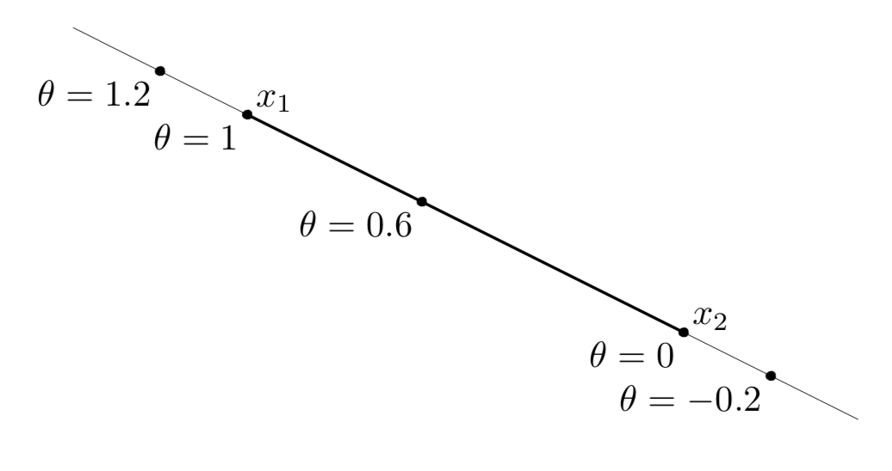

图1 线与线段集合示意图

2.**仿射集**：如果$C \subseteq \mathbf{R}^{n}$是一个仿射集，则在这个集合内任意点的线集合都属于这个集合，即$x_{1}, \ldots, x_{k} \in C \ and \ \theta_{1}+\cdots+\theta_{k}=1$，则$\theta_{1} x_{1}+\cdots+\theta_{k} x_{k}$。仿射集有如下*性质*：假设$C$是一个仿射集，且$x_{0} \in C$，则集合$V=C-x_{0}=\left\{x-x_{0} | x \in C\right\}$是一个子空间，并且仿射集$C$可以表达成$C=V+x_{0}=\left\{v+x_{0} | v \in V\right\}$，即一个子空间加一个补偿。

**Remark for 仿射函数：**一般来说，仿射函数指的是最高次数为$1$的多项式函数，当常数项为$0$时退化为线性函数，即$f(x)=A x+b$是一个仿射函数，如果$f$是一个矢量函数，则$f\left(x_{1}, x_{2}, \ldots, x_{n}\right)=A_{1} x_{1}+A_{2} x_{2}+\ldots+A_{n} x_{n}+b$为一个仿射函数

定义$C$的仿射包(affine hull: aff C)：
$$
\begin{equation}
\label{aff}
\operatorname{aff} C=\left\{\theta_{1} x_{1}+\cdots+\theta_{k} x_{k} | x_{1}, \ldots, x_{k} \in C, \theta_{1}+\cdots+\theta_{k}=1\right\}
\end{equation}
$$
仿射包是仿射集中最小的子集。给出一个例子说明什么是**相对内部(relative interior)**，**相对边界(relative boundary)**：

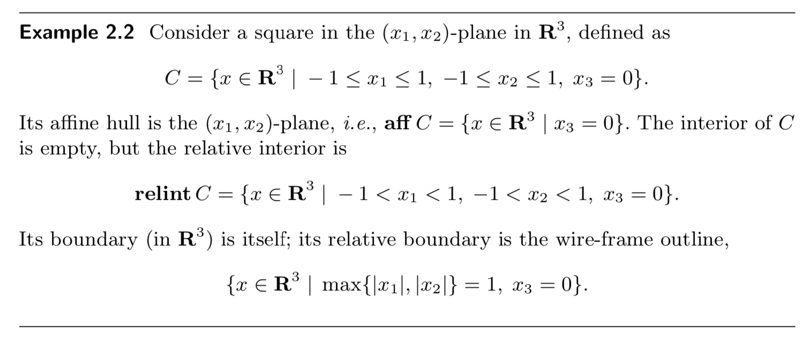

***Remark for 仿射包、开集、闭集、内部、边界、相对内部、相对边界***：
&ensp;&ensp;&ensp;仿射包从式子（\ref{aff}）可知，是各个$x$的组合。
&ensp;&ensp;&ensp;开集指的是不包含边界的集合（如，$1 < x < 2$），闭集指的是包含边界的集合（如，$1 \le x \le 2$）。针对闭集而言，内部就是它的开集；正对开集来说，内部就是它本身。
&ensp;&ensp;&ensp;相对内部以及相对边界是针对仿射包来定义的，即针对某个集合的仿射包，它的内部是什么，它的边界是什么。举个例子：

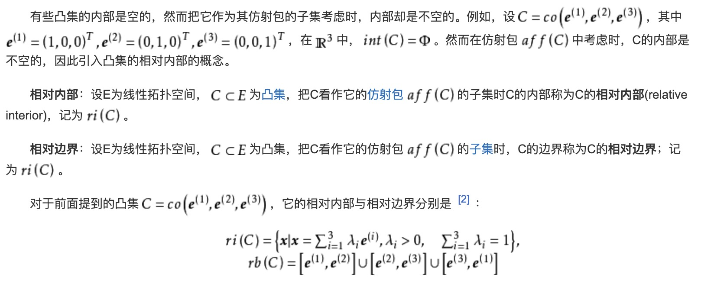

3.**凸集**：对于任意属于集合$C$的$x_1$，$x_2$，存在$0 \leq \theta \leq 1$使得$\theta x_{1}+(1-\theta) x_{2} \in C$，则集合$C$是凸集。凸包(Convex hull)为：
$$
\operatorname{conv} C=\left\{\theta_{1} x_{1}+\cdots+\theta_{k} x_{k} | x_{i} \in C, \theta_{i} \geq 0, i=1, \ldots, k, \theta_{1}+\cdots+\theta_{k}=1\right\}
$$

4.**圆锥集**：对于每一个$x \in C \text { and } \theta \geq 0$都有$\theta x \in C$，更特殊的，如果对于任意$x_{1}, x_{2} \in C \text { and } \theta_{1}, \theta_{2} \geq 0$，都有$\theta_{1} x_{1}+\theta_{2} x_{2} \in C$，则集合$C$是一个凸锥。锥包可以表示为：
$$
\left\{\theta_{1} x_{1}+\cdots+\theta_{k} x_{k} | x_{i} \in C, \theta_{i} \geq 0, i=1, \ldots, k\right\}.
$$

### 保持凸性的运算Operations that preserve convexity
1. 交运算
2. 仿射运算、仿射逆运算
3. 乘、加
4. 投影函数(perspective functions)：函数$P$是一个投影函数当$P : \mathbf{R}^{n+1} \rightarrow \mathbf{R}^{n}$，$P(z, t)=z / t$
5. 线性分割：假设$g : \mathbf{R}^{n} \rightarrow \mathbf{R}^{m+1}$是仿射的，即$g(x)=\left[\begin{array}{c}{A} \\ {c^{T}}\end{array}\right] x+\left[\begin{array}{l}{b} \\ {d}\end{array}\right]$，则函数
$$
f(x)=(A x+b) /\left(c^{T} x+d\right), \quad \operatorname{dom} f=\left\{x | c^{T} x+d>0\right\}
$$
是线性分割函数。

### 一般性不等式
感觉没什么用
### 分割面与支撑面
先介绍一个**分割超平面定理**（使用超平面或者仿射函数来分割不相交的凸集）：假设$C$和$D$是两个不相交的凸集，即$C \cap D = \emptyset$。然后存在$a \ne 0$和$b$，使得${a^T}x \le b$对于所有$x \in C$，${a^T}x \ge b$对于所有$x \in D$。换句话说，${a^T}x - b$这一仿射函数在$C$上是非正的，在$D$上是非负的。对于集合$C$和$D$，超平面$\{ x|{a^T}x = b\} $被称为分离超平面，或被称为分离了集合$C$和$D$。当上述等号不存在时，我们称为**严格分离**。

**支撑面**：图片理解如下所示，其实很简单的就可以理解，就是存在一个面，把某一平面“支”起来了。用数学语句表达为：假设$C \subseteq \mathbf{R}^{n}$，以及$x_0$是一个集合中的边界点，如果$a \neq 0$且$a^{T} x \leq a^{T} x_{0}$对于所有$x \in C$都成立，则超平面$\left\{x | a^{T} x=a^{T} x_{0}\right\}$是一个支撑面。

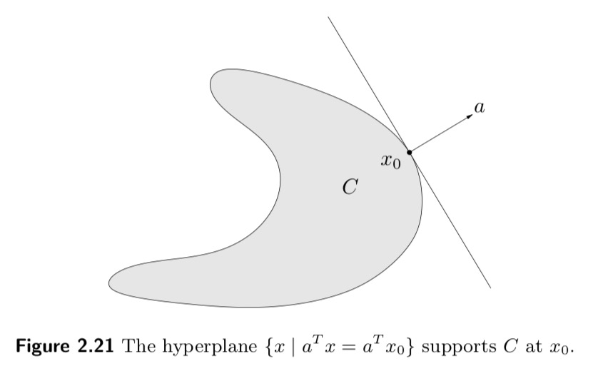

### 对偶圆锥以及一般性不等式
跳过，书本51

## 凸函数
### 基本性质
1.**定义**：如果$f$的定义域是凸集，如果$x$和$y$属于定义域，且$0 \leq \theta \leq 1$，则函数$f$是凸的，且存在下式：
$$
\begin{equation}
\label{convex_function}
f(\theta x+(1-\theta) y) \leq \theta f(x)+(1-\theta) f(y)
\end{equation}
$$
几何解释如图：

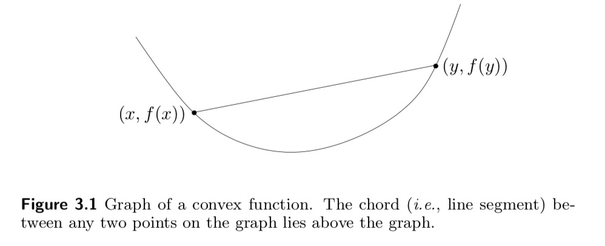

如果$x \neq y$且$0<\theta<1$，则函数是严格凸，相应的$-f$就是（严格）凹。
2.**判定凸函数的条件**：
&ensp;&ensp;&ensp;**一阶充分条件**：假设$f$在定义域（开域，即不包含边界点，边界点不可导无所谓）内是可导的，则当$f$的定义域是凸的，且对于任何属于其定义域的$x$和$y$满足以下式子时
$$
\begin{equation}
\label{first_order}
f(y) \geq f(x)+\nabla f(x)^{T}(y-x)
\end{equation}
$$
$f$是凸函数，当式（\ref{first_order}）等号不成立时，我们称其为严格凸函数。另一方面式（\ref{first_order}）说明了我们可以利用它的一个值和其导数值来推测全局信息，即：全局欠估计 (global underestimator)（式（\ref{first_order}）用一阶泰勒展开大概估计了$f(y)$）。

&ensp;&ensp;&ensp;**二阶充分条件**：假设$f$在定义域内（开域）二阶可导（twice differentiable），则对于所有在定义域内的$x$，若满足
$$
\begin{equation}
\label{second_order}
\nabla^{2} f(x) \succeq 0
\end{equation}
$$
则$f$是凸函数。

3.范数（norms）、最大值函数（Max function）以及二次线性函数$f(x, y)=x^{2} / y$（Quadratic-over-linear function）是凸函数、几何平均函数$f(x)=\left(\prod_{i=1}^{n} x_{i}\right)^{1 / n}$（Geometric mean）是凹函数。

### 上镜图Epigraph
定义为：
$$
\begin{equation}
\label{Epigraph}
\text { epi } f=\{(x, t) | x \in \operatorname{dom} f, f(x) \leq t\}
\end{equation}
$$
几何解释就是函数上面的所有部分就是上镜图，如图所示：

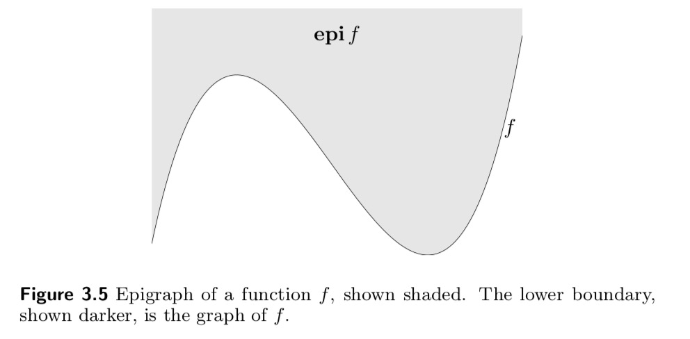

### 子级集Sublevel sets 
Sublevel sets的定义如下：
$$
\begin{equation}
\label{Sublevel_sets}
C_{\alpha}=\{x \in \operatorname{dom} f | f(x) \leq \alpha\}
\end{equation}
$$
***Remark for 上镜图以及子级集***：如果函数是凹的，上述定义也成立，只是不等式符号要变。

### Jensen's 不等式
凸函数的定义（\ref{convex_function}）有时也被称为Jensen's 不等式，且可以拓展为向量形式：
$$
\begin{equation}
\label{convex_vector}
f\left(\theta_{1} x_{1}+\cdots+\theta_{k} x_{k}\right) \leq \theta_{1} f\left(x_{1}\right)+\cdots+\theta_{k} f\left(x_{k}\right)
\end{equation}
$$
拓展为无限形式：
$$
\begin{equation}
\label{convex_infinity}
f\left(\int_{S} p(x) x d x\right) \leq \int_{S} f(x) p(x) d x
\end{equation}
$$
拓展为期望形式：
$$
\begin{equation}
\label{convex_expectations}
f(\mathbf{E} x) \leq \mathbf{E} f(x)
\end{equation}
$$
### 一些常用不等式

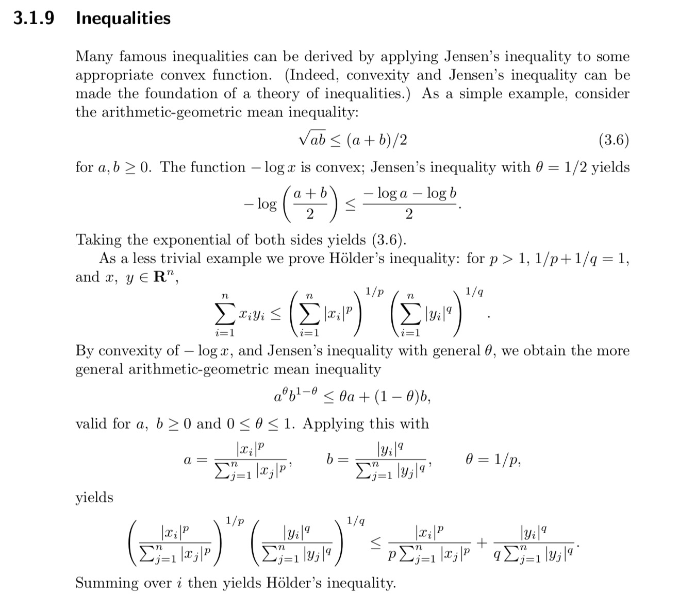

### 保持凸函数的运算

几种运算

1. 非负权重和：
$$
f=w_{1} f_{1}+\cdots+w_{m} f_{m}
$$
2. 积分：
$$
g(x)=\int_{\mathcal{A}} w(y) f(x, y) dy
$$
其中$w(y) \geq 0$
3. 仿射变换：
$$
g(x)=f(A x+b)
$$
4. 分段最大值（或者最大上界）：
$$ f(x)=\max \left\{f_{1}(x), f_{2}(x)\right\} $$
$$ g(x)=\sup _{y \in \mathcal{A}} f(x, y) $$
5. 复合函数：
$$f(x)=h \circ g=h(g(x)), \quad \text { dom } f=\{x \in \operatorname{dom} g | g(x) \in \operatorname{dom} h\}$$
二阶导数为：
$$
f^{\prime \prime}(x)=h^{\prime \prime}(g(x)) g^{\prime}(x)^{2}+h^{\prime}(g(x)) g^{\prime \prime}(x)
$$
从上述二阶导数可知，如果$g$是凸的，则$g^{\prime \prime} \geq 0$，如果h是凸且不减则$h^{\prime \prime} \geq 0 \text { and } h^{\prime} \geq 0 $，所以$f^{\prime \prime} \geq 0$，即$f$是凸函数。同理可得如下四则：

$
\begin{array}{l}{f \text { is convex if } h \text { is convex and nondecreasing, and } g \text { is convex, }} \\ {f \text { is convex if } h \text { is convex and nonincreasing, and } g \text { is concave, }} \\ {f \text { is concave if } h \text { is concave and nondecreasing, and } g \text { is concave, }} \\ {f \text { is concave if } h \text { is concave and nonincreasing, and } g \text { is convex. }}\end{array}
$

其中最值得一提的就是：**最小值：**
$$g(x)=\inf _{y \in C} f(x, y)$$

**一个重要的例子就是Schur补：**

给定一个二次函数：
$$
f(x, y)=x^{T} A x+2 x^{T} B y+y^{T} C y
$$
其中$A$和$C$是对称的，则$f$是凸函数。

证明

$f$对$x$的一阶偏导为：
$$
\begin{array}{l}
\frac{{\partial f}}{{\partial x}} = \frac{{\partial {x^T}Ax}}{{\partial x}} + \frac{{\partial 2{x^T}By}}{{\partial x}}\\
 = \frac{{\partial {x^T}}}{{\partial x}}Ax + \frac{{\partial {{({A^T}x)}^T}}}{{\partial x}}x + \frac{{\partial {x^T}}}{{\partial x}}2By\\
 = Ax + {A^T}x + 2By\\
 = 2Ax + 2By
\end{array}
$$
$f$对$y$的一阶偏导为：
$$
\begin{array}{l}
\frac{{\partial f}}{{\partial y}} = \frac{{\partial {y^T}Cy}}{{\partial y}} + \frac{{\partial 2{x^T}By}}{{\partial y}}\\
 = 2Cy + 2xB
\end{array}
$$
$f$对$x$的二阶偏导为：
$$
\frac{{{\partial ^2}f}}{{\partial {x^2}}} = 2A
$$
$f$对$y$的二阶偏导为：
$$
\frac{{{\partial ^2}f}}{{\partial {y^2}}} = 2C
$$
$f$对$x,y$的二阶偏导为：
$$
\frac{{{\partial ^2}f}}{{\partial x\partial y}} = 2B
$$
$f$对$y,x$的二阶偏导为：
$$
\frac{{{\partial ^2}f}}{{\partial y\partial x}} = 2{B^T}
$$
所以$f$的Hessian矩阵为：
$$
H = \left[ {\begin{array}{*{20}{c}}
{2A}&{2B}\\
{2{B^T}}&{2C}
\end{array}} \right]
$$
令Hessian矩阵大于0即可得到函数f是凸的，即得到f是凸的条件为：
$$
\begin{equation}
\label{Hessian}
\left[ {\begin{array}{*{20}{c}}
A&B\\
{{B^T}}&C
\end{array}} \right] \ge 0
\end{equation}
$$
根据Schur补引理：

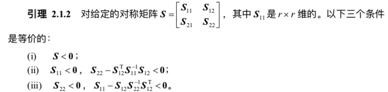

可得$H \ge 0 \Leftrightarrow A \ge 0,A - B{C^ + }{B^T} \ge 0$，其中$C^ +$表示伪逆，如果$C$是可逆的，则可以写成$C^{-1}$。

常见的矩阵求导公式有：
$$\frac{{\partial Ax}}{{\partial x}} = {A^T}$$
$$\frac{{\partial {x^T}A}}{{\partial x}} = A$$

***Remark for Hessian matrix：***求解Hessian矩阵其实不用这么麻烦，只需要将$f(x,y)$写成向量形式，然后中间的矩阵就是Hessian矩阵，即
$$f(x,y)=\left[ {\begin{array}{*{20}{c}}
{{x^T}}&{{y^T}}
\end{array}} \right]\left[ {\begin{array}{*{20}{c}}
A&B\\
{{B^T}}&C
\end{array}} \right]\left[ {\begin{array}{*{20}{c}}
x\\
y
\end{array}} \right]$$

### 共轭函数The conjugate function
**1. 定义：**
$$f^{*}(y)=\sup _{x \in \operatorname{dom} f}\left(y^{T} x-f(x)\right)$$
几何解释为：

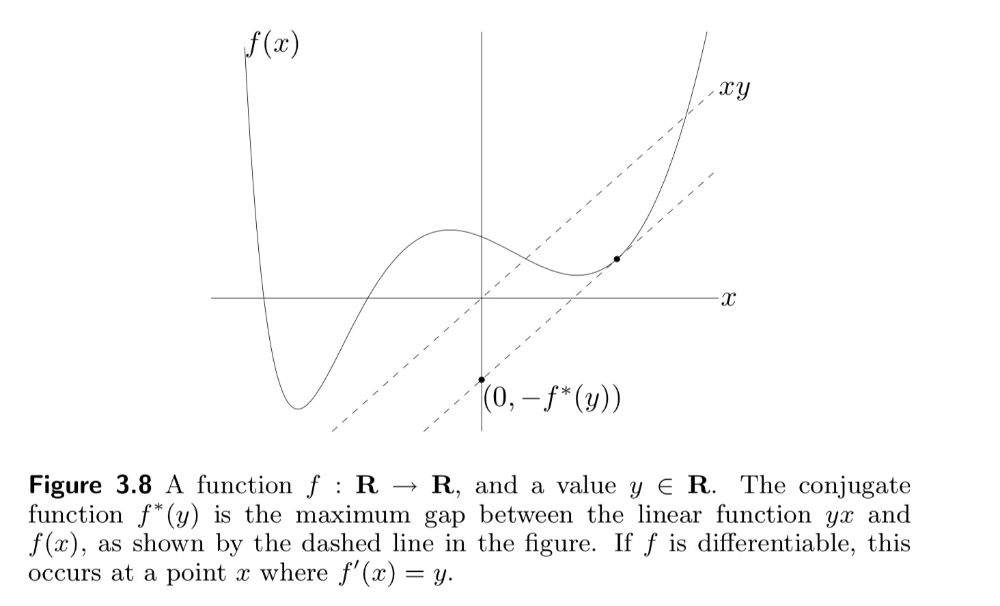

***Remark***：定义的意思其实就是，如何得到$\left(y^{T} x-f(x)\right)$的最大值，如果$f$是可导的，则$\left(y^{T} x-f(x)\right)$对$x$求偏导并令其等于0，求出最大值点再得到最大值即是$f(x)$的共轭函数。

**2. 性质：**
&ensp;&ensp;&ensp;**Fenchel's 不等式**：$f(x)+f^{*}(y) \geq x^{T} y$
&ensp;&ensp;&ensp;**导数**：$f^{*}(y)=x^{* T} \nabla f\left(x^{*}\right)-f\left(x^{*}\right)$
&ensp;&ensp;&ensp;**比例**：$g(x)=a f(x)+b$ 对应 $g^{*}(y)=a f^{*}(y / a)-b$
&ensp;&ensp;&ensp;**复合函数**：$g(x)=f(A x+b)$ 对应 $g^{*}(y)=f^{*}\left(A^{-T} y\right)-b^{T} A^{-T} y$
&ensp;&ensp;&ensp;**求和**：$f(u, v)=f_{1}(u)+f_{2}(v)$ 对应 $f^{*}(w, z)=f_{1}^{*}(w)+f_{2}^{*}(z)$

### 拟凸函数Quasiconvex functions
**1. 定义：**
$$S_{\alpha}=\{x \in \operatorname{dom} f | f(x) \leq \alpha\}$$
几何解释为：

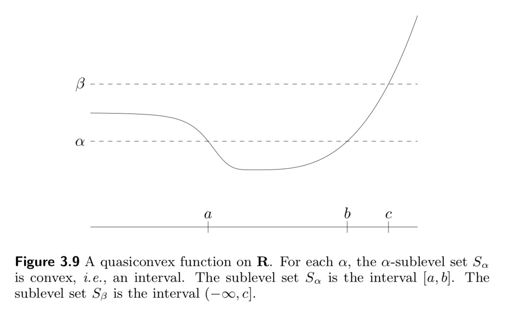

***Remark***：定义的意思其实就是在某个值的下方，在某一个区间内，这个函数是一个凸函数。

**2. 性质：**
&ensp;&ensp;&ensp;**拟凸函数的判定条件**（也被称为是拟凸函数的Jensen不等式）：

判定条件 

1. 函数$f$是拟凸的，当且仅当它的定义域是凸的，且满足$f(\theta x+(1-\theta) y) \leq \max \{f(x), f(y)\}$，其中$0 \leq \theta \leq 1$。
2. f是不增加或者不减少的。
3. 存在一个点$c$使得在区间$t \leq c$，$f$是不增加的，在$t \geq c$，$f$不减少
几何解释就是两张函数图：

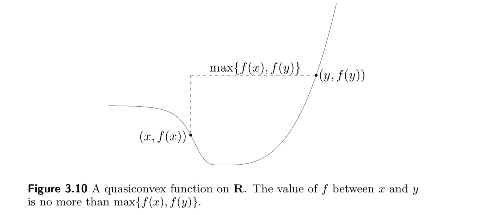

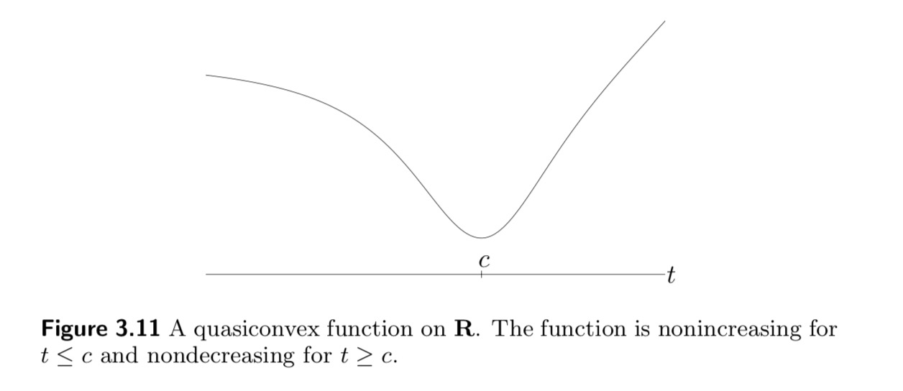

1. 一阶条件（凸函数的一阶条件为（\ref{first_order}））：
$$
\begin{equation}
\label{first_order_quasi}
f(y) \leq f(x) \Longrightarrow \nabla f(x)^{T}(y-x) \leq 0
\end{equation}
$$
2. 二阶条件（凸函数的二阶条件为（\ref{second_order}））：
$$
\begin{equation}
\label{second_order_quasi}
y^{T} \nabla f(x)=0 \Longrightarrow y^{T} \nabla^{2} f(x) y \geq 0
\end{equation}
$$
&ensp;&ensp;&ensp;**保持拟凸的运算**：

运算

&ensp;&ensp;&ensp;非负权重最大值：$f=\max \left\{w_{1} f_{1}, \ldots, w_{m} f_{m}\right\}$
&ensp;&ensp;&ensp;复合函数：$g(x)=f(A x+b)$
&ensp;&ensp;&ensp;最小值：$g(x)=\inf _{y \in C} f(x, y)$

### Log凹、凸函数Log-concave and log-convex P104-108
### 一般行不等式的凸性Convexity with respect to generalized inequalities P108-P111

## 凸优化问题Chapter4 
### 基本术语Basic terminology：
我们定义如下形式为一个带有约束的优化问题：
$$
\begin{equation}
\label{optimization}
\begin{array}{cl}{\operatorname{minimize}} & {f_{0}(x)} \\ {\text { subject to }} & {f_{i}(x) \leq 0, \quad i=1, \ldots, m} \\ {} & {h_{i}(x)=0, \quad i=1, \ldots, p}\end{array}
\end{equation}
$$
其中，定义域为：
$$
\begin{equation}
\label{optimization_domain}
\mathcal{D}=\bigcap_{i=0}^{m} \operatorname{dom} f_{i} \cap \bigcap_{i=1}^{p} \operatorname{dom} h_{i}
\end{equation}
$$
假设该问题有可行解，则最优解和最优值的定义如下：
$$
\begin{equation}
\label{optimal_point}
X_{\mathrm{opt}}=\left\{x | f_{i}(x) \leq 0, i=1, \ldots, m, h_{i}(x)=0, i=1, \ldots, p, f_{0}(x)=p^{\star}\right\}
\end{equation}
$$

$$
\begin{equation}
\label{optimal_value}
p^{\star}=\inf \left\{f_{0}(x) | f_{i}(x) \leq 0, i=1, \ldots, m, h_{i}(x)=0, i=1, \ldots, p\right\}
\end{equation}
$$
如果有一个可行解$x$满足：
$$
\begin{equation}
\label{suboptimal}
f_{0}(x) \leq p^{\star}+\epsilon
\end{equation}
$$
则称为$\epsilon$次优，用专业术语描述为：
$$
\begin{equation}
\label{suboptimal_formal}
\begin{array}{cl}{\underset{}{\operatorname{minimize}}} & {f_{0}(z)} \\ {\text { subject to }} & {f_{i}(z) \leq 0, \quad i=1, \ldots, m} \\ {} & {h_{i}(z)=0, \quad i=1, \ldots, p} \\ {} & {\|z-x\|_{2} \leq R}\end{array}
\end{equation}
$$
### 等价问题Equivalent problems：

